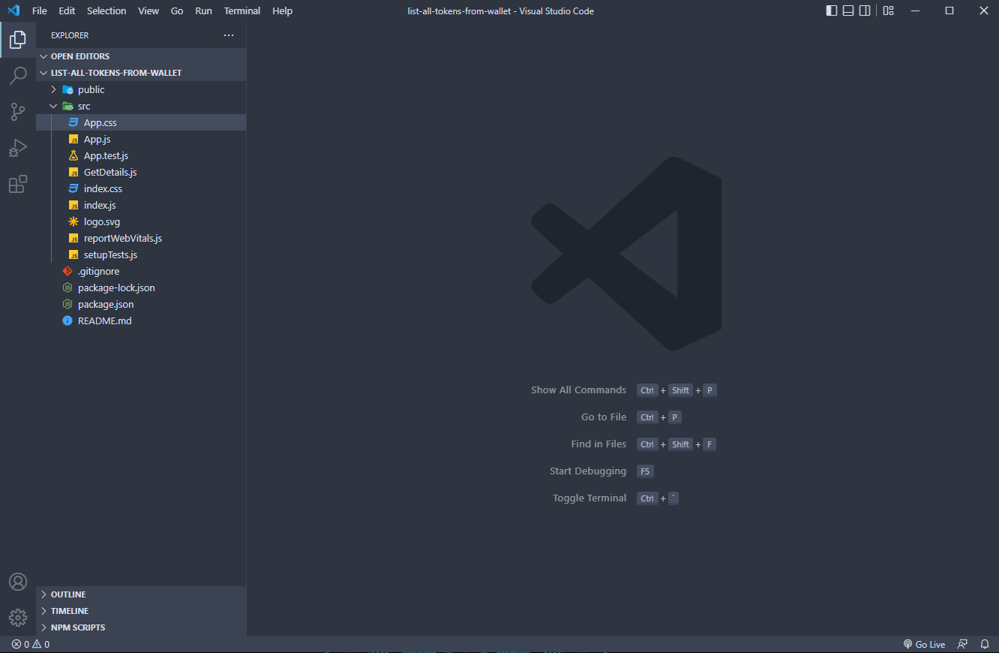
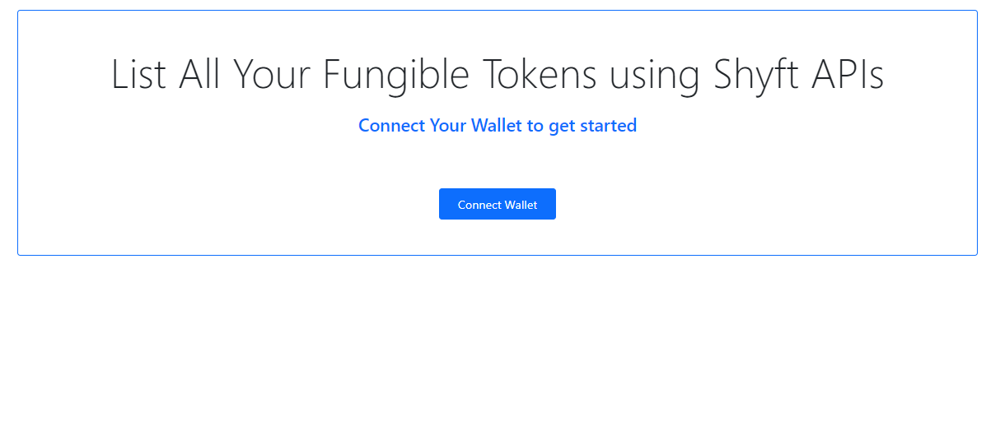
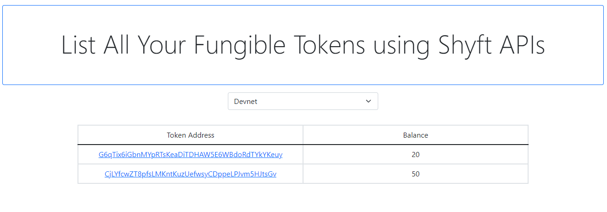
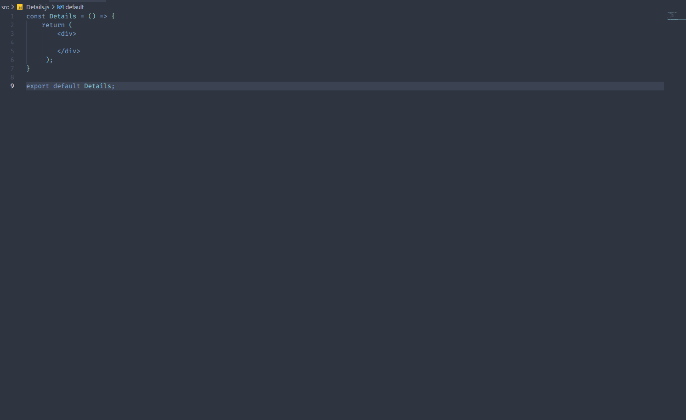
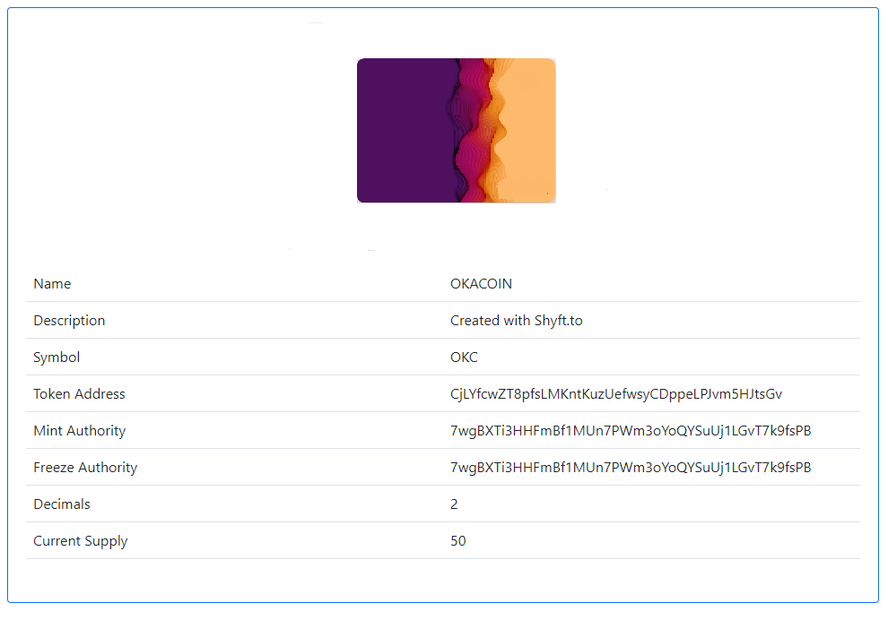

# List all Tokens from your Wallet

In this tutorial we will build a simple app which will list all the fungible tokens tokens in your wallet using our very own SHYFT APIs.
Once done, you will be able view a list of Fungible Tokens from your wallet. 

Read SHYFT Documentation [here](https://docs.shyft.to/).

## Pre-requisites

To get started, we will need a few things. We will need the Phantom wallet browser extension, you can download it from the link below.

* [Chrome/Brave](https://chrome.google.com/webstore/detail/phantom/bfnaelmomeimhlpmgjnjophhpkkoljpa).
* [Firefox](https://addons.mozilla.org/en-US/firefox/addon/phantom-app/).

Once done, set up you Phantom wallet account. On screen tips are available which will guide you to set up and get started. You can also find a detailed guide related to this [here](https://news.coincu.com/2433-the-easiest-guide-to-using-phantom-wallet-on-solana/).

We will use React to develop this project but you can choose any language of your choice. As we are using react we will need Node.js installed on our computer. You can download node.js from [here](https://nodejs.org/en/download/).

## Initial Setup

Now, we are all set to create our first token listing App. Let's create a new React application for building our app. To create a react app, fire up your terminal and use the following command.

```bash
npx create-react-app list-all-tokens-from-wallet
```

This will create a boilerplate template for you new react project. We have used vscode as our code editor for this project, but you can use any code editor of your choice. Once the above command has completed its execution, we will open up that project folder using vscode and it should look like this.



## Building the application

We have divided the project into two parts. 
1) We will create a module for fetching and displaying a list of all the tokens in your wallet.
2) We will create a module for fetching and displaying all the details related of one particular token in this project.

So, let's start building.

## Displaying a list of all tokens in your wallet

### Connecting to Phantom wallet.

This is the first step to required for this part. We will use the Wallet Address from your Phantom Wallet and use it to fetch all tokens currently in your wallet and then we will display them.

To connect to your phantom wallet, we need a few dependencies added to our project. To add these dependencies, we will have to install the packages manually in our project folder or we can add this to the dependencies list inside the `package.json` file and run the `npm install` command to automatically add these to our project. 

Inside the package.json file dependency section, we add the following and the save and hit `npm ci`

```bash
"dependencies": {
    ...
    "@solana/wallet-adapter-phantom": "0.9.7",
    "@solana/web3.js": "^1.50.0",
    "axios": "^0.27.2",    
    ...
  },
  ```
The first to packages mentioned in this list is used for connecting to the phantom wallet, and we will use the `axios` package to make http requests to our [SHYFT APIs](https://docs.shyft.to/).

**Note: Everytime we add a package or a dependency to our project we have to restart the local server.**

Once done, let's run the following command

```bash
npm run start
```

This will start a local development server and your application will be up and running at the following link: [http://localhost:3000](http://localhost:3000)

Now, let's create a new file under the `/src` directory, we have used the name `ListAll.js` but you can name it anything you want. 

Now, let's create a simple button which will connect to the phantom wallet adapter and retrive our wallet address.

(We have used [bootstrap](https://getbootstrap.com/docs/5.0/getting-started/download/) to add very minimal styling to our project but this is not necessary, you can write your own stylesheets or use any other methods for styling your application)



Once created, we have to create a function which will connect to the phantom wallet when invoked. For this we have to import a few things in our `ListAll.js` file.

```javascript
import { clusterApiUrl, Connection, PublicKey } from "@solana/web3.js";
import { PhantomWalletAdapter } from '@solana/wallet-adapter-phantom';
```
and the function for connecting to phantom

```javascript
const solanaConnect = async () => {
    const { solana } = window;
    if (!solana) {
      alert("Please Install Solana");
    }

    try {
      const network = "devnet";
      const phantom = new PhantomWalletAdapter();
      await phantom.connect();
      const rpcUrl = clusterApiUrl(network);
      const connection = new Connection(rpcUrl, "confirmed");
      const wallet = {
        address: phantom.publicKey.toString(),
      };

      if (wallet.address) {
        console.log(wallet.address); 
        //we will get the wallet address here, we can assign it to a state variable
        const accountInfo = await connection.getAccountInfo(new PublicKey(wallet.address), "confirmed");
        console.log(accountInfo);
        
      }
    }
    catch (err) {
      console.log(err);
    }

  }
```
and we will invoke this function once we have clicked on the `Connect Wallet` button as shown above.

If executed successfully, we will receive the wallet address from phantom.

let's create two variables, one for strong the wallet address and one for storing the data we will receive from our APIs. 

```javascript
const [walletAddress,setwalletAddress] = useState(null);
const [data,setData] = useState(null);
```

Once we receive the wallet address, we assign it to the the `walletaddress` state variable created using the react's `useState` hook. 


### Making the API call.

  
**API url we will use here to retrieve the token data:**
```bash
https://api.shyft.to/sol/v1/wallet/all_tokens?network=CURRENT_NETWORK&wallet=WALLET_ADDRESS
```
We will also need to pass `X-API-KEY` in the header, this key is used for authentication purposes.

You can find more about our APIs [here](https://docs.shyft.to/start-hacking/api-reference).

**Getting Your Own X-API-KEY**

`x-api-key` is an important parameter we pass on to the header for authentication purposes. You can get your own `x-api-key` from our own [SHYFT website](https://shyft.to/get-api-key). Just signup with your email id [here](https://shyft.to/get-api-key) and you can get it for free.

Now, once we have the wallet address, we are ready to make the API call to fetch our data. 

To fetch the data, we have used the `axios` package, but you can use javascript's very own fetch or any other package you want. We have made this call inside react's useEffect hook.
Here is the code.

```javascript
const xAPIKey = "YOUR_API_KEY"; //your api key goes here
```

```javascript
useEffect(() => {
    let reqUrl = `https://api.shyft.to/sol/v1/wallet/all_tokens?network=${netWrk}&wallet=${walletAddress}`;

    axios({
        // Endpoint to perform request
        url: reqUrl,
        method: "GET",
        headers: {
        "Content-Type": "application/json",
        "x-api-key": xAPIKey,
        },
    })
        // Handle the response from backend here
        .then((res) => {
            console.log(res.data);
            setData(res.data.result); //storing the token array in data
        })
        // Catch errors if any
        .catch((err) => {
            console.warn(err);
        });
    },[walletAddress,netWrk]);
```
If successful, the response which we get back from the server looks somewhat like this with the `result` containing an array of all the tokens. We store the array of tokens in the data state variable

```javascript
{
    "success": true,
    "message": "2 tokens fetched successfully",
    "result": [
        {
            "address": "G6qTix6iGbnMYpRTsKaeDiTDHAW5E6WBdoRdTYkYKeuy",
            "balance": 20
        },
        {
            "address": "CjLYfcwZT8pfsLMKn21uzUefwsyCDppeLPJvm5HJtsGv",
            "balance": 50
        }
    ]
}
```

Now, let's display this array of tokens in our app. We use javascript's map method to display the array inside a table.

```javascript
data.map((tokn) => (
<tr key={tokn.map}>
    <td className="w-50">
        {tokn.address}
    </td>
    <td className="w-50">
        {tokn.balance}
    </td>
</tr>
))
```



Congratulations, you have just accomplished out first goal, fetching all tokens from your wallet using shyft APIs. Now we move on the next part of our project that is getting the details of one particular token.


## Get the details of one particular token

Now, we will attempt to fetch the details of one particular token using our very own SHYFT APIs. We will design this project as an extension of the previous part of the project using React, but you can also design this as a separate project as well. 

We will attempt to link the tokens in the previous part with a new page which will display all the details of that particular token.

To achieve this, we have to setup a few routes, the home (`/`) route will display the details of all tokens and the view-details (`/view-details`) route will display the details of one particular token. 

To setup the routes, we will use the `react-router-dom` package. To install this package, we run the following command in our terminal inside our project folder.

```bash
npm install react-router-dom
```
Once installed, we have to restart our local server. Now, it's time to setup our routes. 
Let's create a new component, we will name it the `Details` component, but you can name it anything you want. We will place this inside `Details.js`, inside the `\src` directory. It looks somewhat like this.



### Setting Up Routes

Now, inside our App Component (`App.js`), we set up the Routes. For setting up the Routes, we need the following: 

```javascript
import { BrowserRouter as Router, Route, Routes } from "react-router-dom";
```

We will setup two routes, one for listing all the tokens and another one for displaying the details of one particular token. 

```javascript
import { BrowserRouter as Router, Route, Routes } from "react-router-dom";

import ListAll from "./ListAll";
import Details from "./Details";

function App() {
  return (
    <div className="App">
      <Router>
          <Routes>
              <Route exact path="/" element={<ListAll />} />
              <Route exact path="/view-details" element={<Details />} />        
          </Routes>
      </Router>
    </div>
  );
}

export default App;
```

Once setup, we should be able to access the `/view-details` route within our application.

### Linking via URL Parameters

We can link each of the token listed in the `ListAll` component to redirect to the `/view-details` route along with `token_address` and `network` as route parameters. One of the ways we can achieve this is this: 

```javascript
{
  data.map((tokn) => (
    <tr key={tokn.address}>
      <td className="w-50">
        <Link
          to={`/view-details?token_address=${tokn.address}&network=${netWrk}`}
          target="_blank"
        >
          {tokn.address}
        </Link>
      </td>
      <td className="w-50">{tokn.balance}</td>
    </tr>
  ))
  }
```
The `<Link></Link>` component of the `react-router-dom` package will help us to navigate to the desired path.

### Building the details component

Now, let's create a layout for our `Details` component. Inside the `Details.js` file(Details Component), we will create a few state variables using React's `useState` hook for storing the data and a simple layout for displaying the data. Inside the `Details` Component, we use the following:

```javascript
import { useState } from "react";

const Details = () => {
    const [image,setimage] = useState('');
    const [name,setName] = useState(null);
    const [desc,setDesc] = useState(null);
    const [sym,setSym] = useState(null);
    const [tokAddr,setTokAddr] = useState(null);
    const [mint,setmint] = useState(null);
    const [freeze,setFreeze] = useState(null);
    const [deci,setDeci] = useState(null);
    const [curSup,setCurSup] = useState(null);
    return ( 
        <div>
           <div className="container">
                <div className="card border-primary py-3 px-1 mt-5 w-75 mx-auto">
                    <div className="image-container w-25 mx-auto mt-3">
                        
                    </div>
                    <div className="mt-3">
                        <table className="table">
                            <tbody>
                                <tr>
                                    <td className="w-50">Name</td>
                                    <td>{name}</td>
                                </tr>
                                <tr>
                                    <td className="w-50">Description</td>
                                    <td>{desc}</td>
                                </tr>
                                <tr>
                                    <td className="w-50">Symbol</td>
                                    <td>{sym}</td>
                                </tr>
                                <tr>
                                    <td className="w-50">Token Address</td>
                                    <td>{tokAddr}</td>
                                </tr>
                                <tr>
                                    <td className="w-50">Mint Authority</td>
                                    <td>{mint}</td>
                                </tr>
                                <tr>
                                    <td className="w-50">Freeze Authority</td>
                                    <td>{freeze}</td>
                                </tr>
                                <tr>
                                    <td className="w-50">Decimals</td>
                                    <td>{deci}</td>
                                </tr>
                                <tr>
                                    <td className="w-50">Current Supply</td>
                                    <td>{curSup}</td>
                                </tr>
                            </tbody>
                        </table>
                    </div>
                </div>
           </div> 
        </div>
     );
}
 
export default Details;
```


### Getting the details of one particular token.

Now the `token_address` and `network` params should be available in the `Details` component, as we have passed them via route parameters. This is one way of passing the token address. but you can have your own method if you want. If this was a separate application, we could have used a form to collect the token address and the other required parameters. Now, let's see how we can get the details of one particular token.

**SHYFT API to fetch the details of one particular token**
```bash
https://api.shyft.to/sol/v1/token/get_info?network=CURRENT_NETWORK&token_address=TOKEN_ADDRESS
```

Before making this API call, we need to have our X-API-KEY. `x-api-key` is an important parameter we pass on to the header for authentication purposes. You can get your own `x-api-key` from our own [SHYFT website](https://shyft.to/get-api-key). Just signup with your email id [here](https://shyft.to/get-api-key) and you can get it for free.

Once we have our X-API-KEY, we are all set. We will use the axios package to make the API call, but you can use any other package or Javascript's very own fetch to make this call. 

```javascript
const xAPIKey = 'YOUR_X_API_KEY'; //enter your X-API-KEY here 
const ApiParams = window.location.search.substring(1); //fetching the url params
```

```javascript
useEffect(() => {
        let reqUrl = `https://api.shyft.to/sol/v1/token/get_info?${ApiParams}`;
        axios({
            // Endpoint to perform request
            url: reqUrl,
            method: "GET",
            headers: {
                "Content-Type": "application/json",
                "x-api-key": xAPIKey,
            },
          })
            // Handle the response from backend here
            .then((res) => {
              console.log(res.data); //we get the response here
                
            })
            // Catch errors if any
            .catch((err) => {
              console.warn(err);
            });
    },[ApiParams]);
    
```

Once successful, it should return a response which will contain all the information related to the token. Here is a sample response:

```javascript
{
    "success": true,
    "message": "Tokens info",
    "result": {
        "name": "Mad Bug",
        "symbol": "MFB",
        "description": "Hair on fire problem solving",
        "image": "https://nftstorage.link/ipfs/bafybeib33qdmutebxe5ssucpkngmpemkyfedkp7533pquv7l2yegqrotb4",
        "address": "b656nATaqUKaQTC6m5to758ySR86eRbPcvN85RpmRHf",
        "mint_authority": "Gpxrb2UMTKwmBMrXtc5asyk7ga2TaSwfyjtw7Xsw8HFp",
        "freeze_authority": "Gpxrb2UMTKwmad2BMrXt2Mc5yk7ga2TaSwtw7Xsw8HFp",
        "current_supply": 1,
        "decimals": 0
    }
}
```

Now, for the final step, we will assign the data received in the response to the state variables, to display the details in the component. Here is the part of the snippet we will use to update the details.

```javascript
.then((res) => {
  console.log(res.data);
  if(res.data.success === true)
  {
    setName(res.data.result.name);
    setDesc(res.data.result.description);
    setimage(res.data.result.image);
    setSym(res.data.result.symbol);
    setTokAddr(res.data.result.address);
    setmint(res.data.result.mint_authority);
    setFreeze(res.data.result.freeze_authority);
    setDeci(res.data.result.decimals);
    setCurSup(res.data.result.current_supply);
  }
  else
  {
    setName('Failed to Load Data');
  }
    
})
```
And that's all you have to do get the details of the token.



Congratulations, you have just completed creating a DAPP in which you can get all the tokens in your wallet and their details.

Feel free to clone our code and contribute to our community. 

If you liked this, you can learn more about SHYFT APIs in our [API Documentation](https://docs.shyft.to/).

You can view a more refined version of this project [here](https://solana-fungible-tokens-project.vercel.app/).
