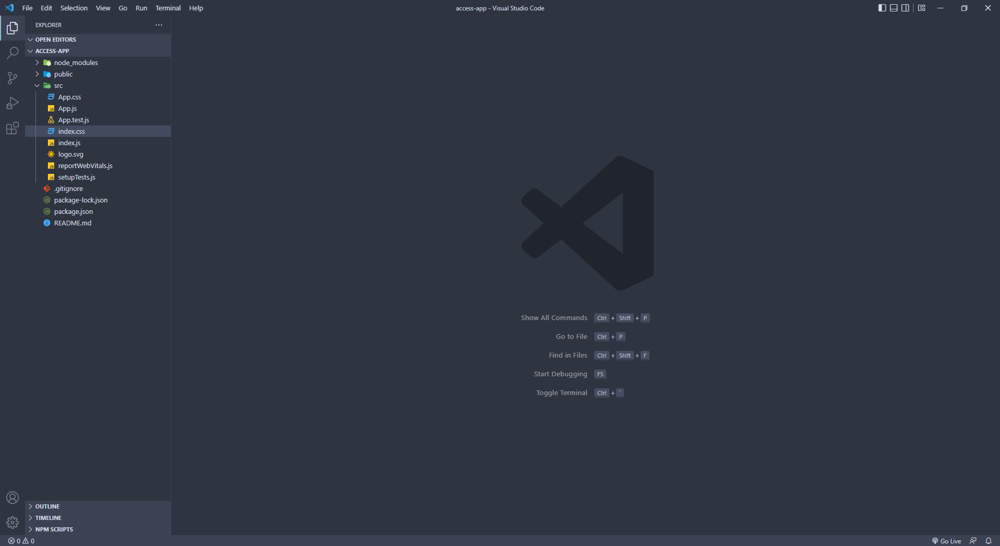
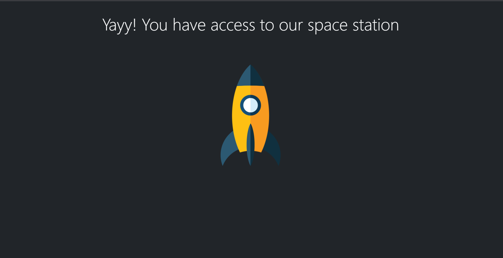
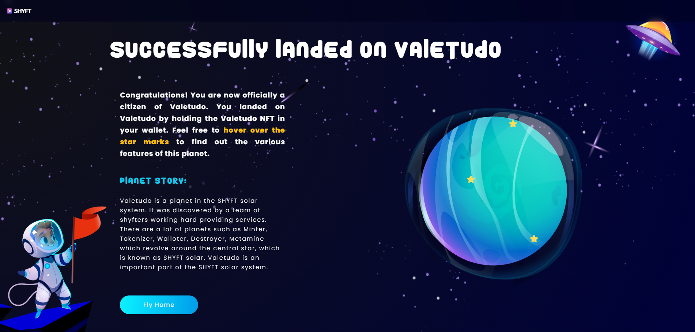

# Utility NFTs: How to use NFTs as an access token to our own web-portal.

In this sample project tutorial, we will learn about Utility NFTs and how we can use an NFT as an access token to a web portal.

## What are Utility NFTs?
Utility NFTs, or NFTs with utility are special kind of NFTs which have use cases that go beyond just being one-of-a-kind NFTs. They are NFTs which give their owners special privileges, access rights or prizes that the would not otherwise have.

For example, if we have a private party, and 200 people are to be invited, we can printout and issue 200 invitation passes. Each pass will be non-fungible i.e. they will have unique pass numbers. However, every individual pass grants the same privilege, in this instance that is admission to the private party. The party organizer could provide 200 utility NFTs instead of 200 printed invitations. The NFTs will be distinct, non-fungible and will function exactly like the printed invitation, i.e. they will grant admission to the private party.  

Even though discovering real world use cases for NFTs is at a very early stage, the cryptographically distinct tokens have the potential to be more than just JPEGs stored on a specific blockchain. Utility NFTs, or NFTs with real-world applications, may potentially be the catalyst for the transition of NFTs from just an investment fad to a brand new mode of interaction, play and work. In the the following sample project tutorial, we will see how we can use an NFT as an access token. We will check if one particular NFT is in your wallet or not (using [SHYFT APIs](https://https://shyft.to/)), and accordingly we will grant you access to a portal. 

Read SHYFT Documentation [here](https://docs.shyft.to/).

## Pre-requisites for the project

To get started, we will need a few things. 

### Authentication: Get your Shyft API key

`x-api-key` is an authentication parameter, which gives you access to SHYFT APIs. You can get your own API Key from the SHYFT website. Just signup with your email id here and you can get it for free.

### Phantom Wallet browser extension

We will need the Phantom wallet browser extension, you can download it from the link below.

* [Chrome/Brave](https://chrome.google.com/webstore/detail/phantom/bfnaelmomeimhlpmgjnjophhpkkoljpa).
* [Firefox](https://addons.mozilla.org/en-US/firefox/addon/phantom-app/).

Once done, set up you Phantom wallet account. On screen tips are available which will guide you to set up and get started. You can also find a detailed guide related to this [here](https://news.coincu.com/2433-the-easiest-guide-to-using-phantom-wallet-on-solana/).

We will use React to develop this project but you can choose any language of your choice. As we are using react we will need Node.js installed on our computer. You can download node.js from [here](https://nodejs.org/en/download/).

## Let's start building

In this sample project, we will design a web portal and grant users access to that particular web portal based on one particular type of NFT in their wallet. We will first use [SHYFT's](https://https://shyft.to/) `read_all` API to access a list of all NFT's in the user's wallet and check for an NFT with a specified update authority, or any specific attribute. If found, we will navigate the user to a new web portal.

If we cannot find the specified NFT, we can provide the user an option to mint a new NFT using SHYFT API's.

**Create React App**

To create new react app, navigate to the directory in which you want to create a react app and open the terminal in that particular directory. Then use to following command to create a new react application.

```bash
npx create-react-app access-app
```

This will create new react application and we will be all set to start creating our new react application. 

**Code Editor**

We have used `VScode` as our code editor form this project but you can use any editor of your choice such as Sublime text, Notepad++, Atom or any editor of your choice. Once decided, let's open up our project in `VScode` editor. It should look something like this. 





## Connect Wallet and check module

Let's create a new module which will connect our wallet and check if one particular NFT is present in your wallet or not. We will need a few packages to get this module working. We have also used some of these modules in our previous projects, you can find the details [here](https://docs.shyft.to/tutorials/how-to-get-your-users-token-balances).  

For connecting the wallet, we install and use the following packages, 

```bash
npm install @solana/web3.js @solana/wallet-adapter-phantom
```

and we will need the following packages for making network request. 

```bash
npm install axios
```

Once done, let's create a react component for connecting the wallet. We will add a simple button which will connect the wallet and will get your wallet address. Once we have the wallet address, we will use [SHYFT APIs](https://https://shyft.to/) to get all the wallet NFTs for checking purpose. Please note that we have used very preliminary styling for our sample project, but you can add styles of your own if you want.


We create a function which we will use to connect a wallet, and we will execute this function when we click on the connect wallet. before that we create a few state variables using react's very own `useState` hook for storing the wallet address and checking if we have access to the portal or not. 

```reactJSX
const [walletId,setWalletId] = useState(null);
const [hasAccess,setAccess] = useState(false);
```
Now we create the connect wallet function.

```javascript
const connectWallet = async () => {
    const { solana } = window;
    
    if(!solana)
    {
        alert("Please Install Phantom"); //If wallet Adapter not installed
    }
    try{  
        const network = "devnet";
        const phantom = new PhantomWalletAdapter();
        await phantom.connect();
        const rpcUrl = clusterApiUrl(network);
        const connection = new Connection(rpcUrl,"confirmed");
        
        const wallet = {
            address: phantom.publicKey.toBase58(), //getting the wallet id in base 58 format
        };

        if(wallet.address)
        {
            const accountInfo = await connection.getAccountInfo(new PublicKey(wallet.address),"confirmed");
            console.log(accountInfo); 
            console.log('Wallet Connected'); 
            setWalletId(wallet.address); //setting the wallet id using reacts setState.
        }

    }
    catch(err)
    {
        console.log(err);
    }
}
```

There are several other methods that can be used to connect wallets, we have used this one, but can use any method you feel like. You can even take the wallet address as an input field directly. 

Once connected, we are ready to make our API call. We use react's `useEffect` hook to make the API call, and we add the `walletId` state variable as a dependency, so that the API call takes place whenever the `walletId` changes.

## The API call to fetch all NFTs

Our API endpoint for reading al NFTs
```bash
https://api.shyft.to/sol/v1/nft/read_all?network=devnet&address=wallet_address
``` 

```javascript
useEffect(() => {
        let nftUrl = `https://api.shyft.to/sol/v1/nft/read_all?network=devnet&address=${walletId}`;
        const xKey = 'your-x-api-key-from-shyft-website'

        axios({
          // Endpoint to get NFTs
          url: nftUrl,
          method: "GET",
          headers: {
            "Content-Type": "application/json",
            "x-api-key": xKey,
          },
        })
          // Handle the response from backend here
          .then((res) => {
            console.log(res.data);
            if (res.data.success === true) {
              setNfts(res.data.result);
            } 
          })
          // Catch errors if any
          .catch((err) => {
            console.warn(err);
            
          });
    
     
    }, [walletId]);
```

If the response form this API is true, we should have a response which looks somewhat like this.

```json
{
  "success": true,
  "message": "Your all NFTs",
  "result": {
    "count": 3,
    "nfts": [
      {
        "name": "Shyft",
        "symbol": "SH",
        "royalty": 0,
        "image_uri": "https://ipfs.io/ipfs/bafkreibivcky2t2bycsycp5d57ubtqaznqtqdnnw7grbvrrc4zdfrnspfu",
        "description": "Shyft, not accenture",
        "attributes": {},
        "mint": "3PCt2frS9X5RwuH2KnebpUpHXcAqszvrWHnZg2m1wqDr",
        "owner": "BvzKvn6nUUAYtKu2pH3h5SbUkUNcRPQawg4bURBiojJx",
        "update_authority": "BvzKvn6nUUAYtKu2pH3h5SbUkUNcRPQawg4bURBiojJx"
      },
      {
        "name": "SHYFT",
        "symbol": "SHF",
        "royalty": 5,
        "image_uri": "https://ipfs.io/ipfs/bafkreig7amamflgtsovczf2el7jt7kuwf274jeaeofjy7iaa34r7exydzm",
        "description": "some description",
        "attributes": {
          "health": 100
        },
        "mint": "9XTGWZENKa18N1vgCQ3RjJWHG92Di2JKYi73jiC4hkEM",
        "owner": "BvzKvn6nUUAYtKu2pH3h5SbUkUNcRPQawg4bURBiojJx",
        "update_authority": "BvzKvn6nUUAYtKu2pH3h5SbUkUNcRPQawg4bURBiojJx"
      },
      {
        "name": "Nightweaver",
        "symbol": "NW",
        "royalty": 0,
        "image_uri": "ipfs://bafkreibivcky2t2bycsycp5d57ubtqaznqtqdnnw7grbvrrc4zdfrnspfu",
        "description": "Night is considered to be a synonym for black in many cultures, a color which can absorb every other color. The Noki tribe, creators of this sword is believed by many to dwell in the darkness. Forged using the dark energy of the night, this sword can even slice through darkness itself.",
        "attributes": {
          "Performance": "28",
          "Fortune": "20",
          "Regeneration": "26",
          "Quality": "Rare"
        },
        "mint": "ApJPjFr585xKSMk7EtAKU4UrcpyEgdN7X8trvd3gChYk",
        "owner": "BvzKvn6nUUAYtKu2pH3h5SbUkUNcRPQawg4bURBiojJx",
        "update_authority": "BvzKvn6nUUAYtKu2pH3h5SbUkUNcRPQawg4bURBiojJx"
      }
    ]
  }
}
```

If successful, we get the list of NFTs in the response, and we assign this array of NFTs to a state variable which we will use for checking purposes. Once complete, we will iterate through this array while we check for the `update_authority` parameter for authentication. We can check for `update_authority` being equal to a specific wallet address, the wallet address which we want to use for authentication purposes. For example, if we want to allow users who have one NFT with an `update_authority` = `AagBXTi3HHFNMqTcWm3oYoQYSuUj1LGvb12vsPB`, we will have to check `update_authority` being equal to this wallet address. We can also perform checking on NFTs with specific attributes, and check if the user's wallet has one NFT with some specified value such as ***"health:50"*** or ***"Power: 100"***, or maybe an attribute as a password, but we have checked used `update_authority` for authentication.


## Checking if the user has access and redirecting to the portal

```javascript
let flag = 0;
nfts.forEach((element) => {
  if (
    element.update_authority ===
    "wallet_address_of_the_wallet_who_has_the_update_authority" //add the wallet address which you want to check as an authentication parameter
    //access will be granted if and only if an NFT with this update authority is present in your wallet
  ) {
    flag = 1;
  }
});
if (flag === 1) {
    setAccess(true);
    //redirect user from here
} else {
    //dont redirect, and display the error message
    setAccess(false);
    setMsg('You do not have access');
}
```

Once authenticated we can redirect the user to our access portal. 




If the authentication fails, that is, if the user does not have the NFT in their wallet, we can give them an option to mint an NFT from another wallet, this is illustrated on our next sample project tutorial.

That is all regarding this sample project tutorial, where we see how we can use NFT as an access token to access a portal.

Link to this sample project. {link here}
Feel free to clone the code and try out the various features. 

A more refined version of this project with added styles and flow is available [here](https://nft-as-access-token.vercel.app/).




To find our more about our APIs, you can read SHYFT API Documentation [here](https://docs.shyft.to/).

Hope you have a great time building Dapps with SHYFT APIs. Happy Hacking!!
